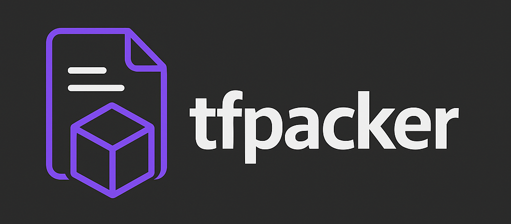

# tfpacker



**tfpacker** is a CLI utility that organizes Terraform resources into separate files based on customizable rules.

## Features

- Groups Terraform blocks by type, name prefix, regex patterns, or custom rules
- Supports type-agnostic grouping based on resource names
- Supports all Terraform block types:
  - `resource` blocks (e.g. `aws_s3_bucket` → `aws_s3_bucket.tf`)
  - `data` blocks
  - `module` blocks
  - `variable` blocks
  - `output` blocks
  - `locals` blocks
  - `provider` blocks
- Configurable via YAML
- Dry-run mode to preview changes
- Scans all `.tf` files in a directory
- Outputs clean, grouped `.tf` files

## Installation

```bash
go install github.com/jackchuka/tfpacker@latest
```

## Usage

```bash
tfpacker [options] [./your-tf-directory]
```

If no directory is provided, `tfpacker` defaults to the current directory.

### Options

- `--config` - Path to config file (default: tfpacker.config.yaml)
- `--dry-run` - Show what would be done without making changes
- `--verbose` - Enable detailed logging
- `--exclude` - Patterns to exclude from processing (comma-separated)
- `--version` - Show version information

## Configuration

You can customize how `tfpacker` organizes your Terraform files by creating a `tfpacker.config.yaml` file:

```yaml
rules:
  # Basic type-based matching
  - match_type: "resource"
    sub_type: "aws_s3_bucket"
    output_file: "storage.tf"
  - match_type: "data"
    sub_type: "aws_region"
    output_file: "aws.tf"
  
  # Name prefix matching
  - match_type: "variable"
    name_prefix: "db_"
    output_file: "database.tf"
  
  # Group all database-related resources by name regex, regardless of type
  - name_regex: "^db_.*|.*_database$"
    ignore_type: true
    output_file: "all_database.tf"
    
  # Regex matching with specific type
  - match_type: "resource"
    name_regex: "^api_.*"
    output_file: "api_resources.tf"
```

### Rule Matching

Rules are evaluated in order, and the first matching rule determines the output file. Each rule can have the following properties:

- `match_type` - The type of block to match (e.g., `resource`, `data`, `module`, etc.)
- `sub_type` - For `resource` and `data` blocks, the provider resource type (e.g., `aws_s3_bucket`)
- `name_prefix` - Match resources by name prefix (e.g., `prod_` would match `prod_bucket`)
- `name_regex` - Match resources by name using a regular expression (e.g., `^db_.*|.*_db$` would match names starting with `db_` or ending with `_db`)
- `ignore_type` - When set to `true`, the rule will match resources regardless of their type, based only on name matching
- `output_file` - The output file to write matching blocks to

If no rule matches, default grouping is applied:

- Resources: `resource_TYPE.tf` (e.g., `resource_aws_s3_bucket.tf`)
- Data sources: `data_TYPE.tf` (e.g., `data_aws_region.tf`)
- Modules: `modules.tf`
- Variables: `variables.tf`
- Outputs: `outputs.tf`
- Locals: `locals.tf`
- Providers: `providers.tf`
- Others: `TYPE.tf` (e.g., `terraform.tf`)

## Example

```hcl
# before: main.tf
resource "aws_s3_bucket" "bucket1" { ... }
resource "aws_iam_role" "role1" { ... }
variable "region" { ... }
variable "db_password" { ... }
module "vpc" { ... }

# after running tfpacker with default rules
resource_aws_s3_bucket.tf  # Contains the S3 bucket resource
resource_aws_iam_role.tf   # Contains the IAM role resource
variables.tf               # Contains the region variable
module.tf                  # Contains the VPC module

# after running tfpacker with regex and ignore_type rules
storage.tf                 # Contains the S3 bucket resource
iam.tf                     # Contains the IAM role resource
variables.tf               # Contains the region variable
all_database.tf            # Contains the db_password variable (matched by regex)
module.tf                  # Contains the VPC module
```

## Contributing

Contributions are welcome! Please feel free to submit a Pull Request.
